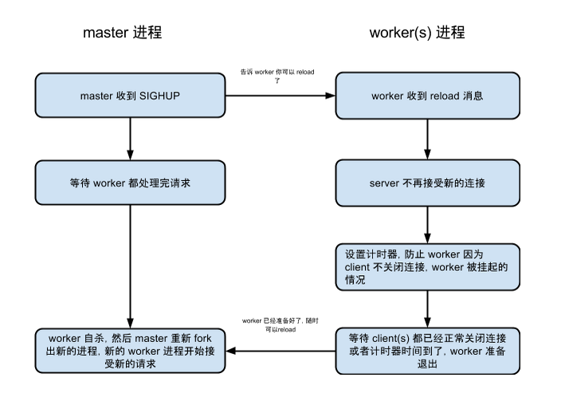

# 使用 Node.js cluster 模块实现 graceful reload


Node.js 由于是单线程的，为了更好的利用多核，官方提供了 cluster 模块。
cluster 模块可以让开发者很容易的创建子进程，这些子进程共享端口。

以下是官网的一段使用 cluster 使用的样例代码：

```
var cluster = require('cluster');
var http = require('http');
var numCPUs = require('os').cpus().length;

if (cluster.isMaster) {
  // Fork workers.
  for (var i = 0; i < numCPUs; i++) {
    cluster.fork();
  }

  cluster.on('exit', function(worker, code, signal) {
    console.log('worker ' + worker.process.pid + ' died');
  });
} else {
  // Workers can share any TCP connection
  // In this case its a HTTP server
  http.createServer(function(req, res) {
    res.writeHead(200);
    res.end("hello world\n");
  }).listen(8000);
}
```

Node.js 中 cluster 模块 fork 出的工作进程与主进程的实现 [IPC](http://zh.wikipedia.org/wiki/%E8%A1%8C%E7%A8%8B%E9%96%93%E9%80%9A%E8%A8%8A) 的方式是管道（pipe），具体实现细节由libuv提供，在Windows下由命名管道（named pipe）实现，*nix系统则采用Unix Domain Socket实现。表现在应用层上的进程间通信只有简单的　message　事件和　send() 方法，接口十分简单和消息化。

graceful reload 的好处想必大家都知道，有一点就是快，比 stop -> start　快很多，这样时间窗口小，可以减少在重启的过程中，客户端返回服务端时，报一堆的异常。

先把代码贴出来了：

+ TCP server

```
var net = require('net');

var server = net.createServer(function (client) {
  client.on('data', function (data) {
    console.log(data.toString());
    client.write('hello world');
  });

  client.on('end', function () {
    console.log('recv fin packet');
  });

  client.on('close', function () {
    console.log('connection fully closed');
  });
});

module.exports = server;
```

+ 核心 graceful reload 实现代码

```
/**
 * Use Node.js cluster module implement graceful reload TCP/HTTP server.
 */

var cluster = require('cluster');
var net = require('net');
var os = require('os');

var cpuNums = os.cpus().length;

var GRACEFUL_SHUT = 'graceful_shutdown';
var FULLY_CLOSED = 'fully_closed';

var server = require('./server');

/**
 * Run test server.
 */
var run = function () {
  if (cluster.isMaster) {
    var i = 0;
    // Create workers.
    for (i = 0; i < cpuNums; i++) {
      cluster.fork();
    }

    // Woker uncaught exit.
    cluster.on('exit', function (worker, code, signal) {
      if (!worker.suicide) {
        console.log('worker %d died (%s). restarting...',
          worker.process.pid, signal || code);
        cluster.fork();
      }
    });

    // Worker has started.
    cluster.on('online', function (worker) {
      console.log('worker %d has stared', worker.process.pid);
    });

    // Listen SIGHUP for graceful reload.
    process.on('SIGHUP', function () {
      Object.keys(cluster.workers).forEach(function (id) {
        // Tell worker doesn't accept new connection.
        cluster.workers[id].send(GRACEFUL_SHUT);

        cluster.workers[id].on('message', function (msg) {
          if (msg === FULLY_CLOSED) {
            // Worker kills itself.
            cluster.workers[id].kill();

            // Reload.
            cluster.fork();
          }
        });
      });
    });

  } else {
    server.listen(11111);

    process.on('message', function (msg) {
      // If msg is equal GRACEFUL_SHUT, worker graceful restarts.
      if (msg === GRACEFUL_SHUT) {
        // server starts to refuse accept new connection.
        server.close();

        // Set timeout to force worker reload.
        var timeout = setTimeout(function () {
          process.send(FULLY_CLOSED);
        }, 100000);

        server.once('close', function () {
          // server fully closed.
          clearTimeout(timeout);
          process.send(FULLY_CLOSED);
        });
      }
    });
  }
};

run();
```

TCP server 的代码没啥好说的，这里就是创建一个 TCP server 对象，然后对 client 这个对象，初始化所要监听的事件，因为后面的实验会使用到。

在核心的实现 graceful reload 的代码函数 run 中，在代码块

```
if (cluster.isMaster) {
  ...
}
```

首先通过 **cluster.fork** 创建和 CPU 数目一致的进程，并在 master 进程，设置上一些事件监听器：

+ `exit` 事件

	主要是监听 worker 是否是异常退出，当 worker 异常退出时，master 会主动 fork 一个新的 worker出来。

+ `online` 事件

	主要是监听 worker 是否已经正常启动起来。


然后在 master 进程还监听用于 reload 的信号 SIGHUP，当使用命令 **kill -HUP pid** 时，进程会捕获这个信号，执行里面的 reload 操作，具体的操作在后面细讲。
在 else 中的代码块，主要是启动 worker 要执行的任务，这里就是启动 TCP Server 了，以及 worker 进程监听通过管道发送过来的消息。

啰嗦了这么久，差不多到正题了，不过还是先看一个 reload 的流程图吧：


```
cluster.workers[id].send(GRACEFUL_SHUT);

cluster.workers[id].on('message', function (msg) {
  if (msg === FULLY_CLOSED) {
    // Worker kills itself.
    cluster.workers[id].kill();

    // Reload.
    cluster.fork();
  }
});
```

上面的代码，就是在 master 进程中，给 worker 发送`graceful_shut`的消息，然后再在 master 进程中等待，worker 回应的已经准备好 reload 的消息。当收到`fully_closed`的消息后，当前收到消息的 worker 就会自杀，然后 master 再 fork 出新的 worker 进程。

```
process.on('message', function (msg) {
  // If msg is equal GRACEFUL_SHUT, worker graceful restarts.
  if (msg === GRACEFUL_SHUT) {      
  	// server starts to refuse accept new connection.
    server.close();

    // Set timeout to force worker reload.
    var timeout = setTimeout(function () {
      process.send(FULLY_CLOSED);
    }, 100000);
    
    server.once('close', function () {
      // server fully closed.
      clearTimeout(timeout);
      process.send(FULLY_CLOSED);
    });
  }
});
```
上面的代码，在 worker 进程，如果收到了`graceful_shut`的消息， `server.close()` 表示 server socket 不再接受新的连接，但是会处理已经建立连接中数据，直到这样已经连接的关闭，server socket 才会真正的 `close` ，然后 server 会捕获发出的 `close` 事件，这样 worker 才能`放心`的退出。不过当 client 使用长连接的时候，client 不会主动的去断连接，为了防止 worker 被挂起（ `close` 事件一直不发生），这里需要设置一个计时器。上面的代码设置了一个100s的计时器，如果100s之后 server socket 还没有关闭，就会强制 reload.

详细的运行结果，我就不贴了，有兴趣的同学可以自行实验。

+ 启动 server
	
	node example.js

+ Graceful reload

	kill -HUP PID
	

### 附录

+ [Node.js cluster](https://nodejs.org/api/cluster.html)
+ [The Art of Graceful Reloading](http://uwsgi-docs.readthedocs.org/en/latest/articles/TheArtOfGracefulReloading.html)

